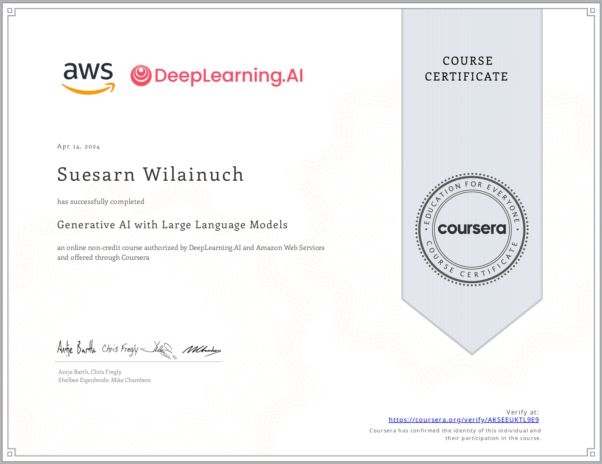

# 🧠 Generative AI with Large Language Models

This repository contains the lab work and key learnings from the Coursera course **"Generative AI with Large Language Models"**, covering foundational to advanced techniques in LLM-based summarization and fine-tuning.

---

## 🧪 Labs Overview

### ✅ Lab 1 – Summarize Dialogue with Generative AI

- Perform **dialogue summarization** using pre-trained LLMs
- Explore **in-context learning**:
  - **Zero-shot**, **one-shot**, and **few-shot** inference
- Experiment with **prompt engineering** and **configuration tuning** to influence generation quality

🔍 *Key Concepts*:
- Prompt templates
- Temperature, top-k/top-p sampling
- Response variability in LLMs

---

### 🛠️ Lab 2 – Fine-Tune Flan-T5 for Dialogue Summarization

- Fine-tune a **Flan-T5 model** on dialogue summarization data
- Compare:
  - 🔧 **Full fine-tuning**
  - 🔁 **PEFT (Parameter-Efficient Fine Tuning)** using **LoRA (Low-Rank Adaptation)**
- Evaluate results using **ROUGE metrics**

🧩 *Key Techniques*:
- Hugging Face `Trainer` API
- LoRA with `peft` library
- Evaluation with `rouge_score`

---

### 🎯 Lab 3 – Reinforcement Learning (RLHF) for Positive Summaries

- Apply **reinforcement learning (RLHF)** to align model output with desired tone
- Use reward models like **Meta AI’s Hate Speech model**
- Fine-tune using **PPO (Proximal Policy Optimization)**

⚙️ *Pipeline*:
1. Base: Flan-T5
2. Reward model for toxicity detection
3. PPO for feedback-based learning

---

