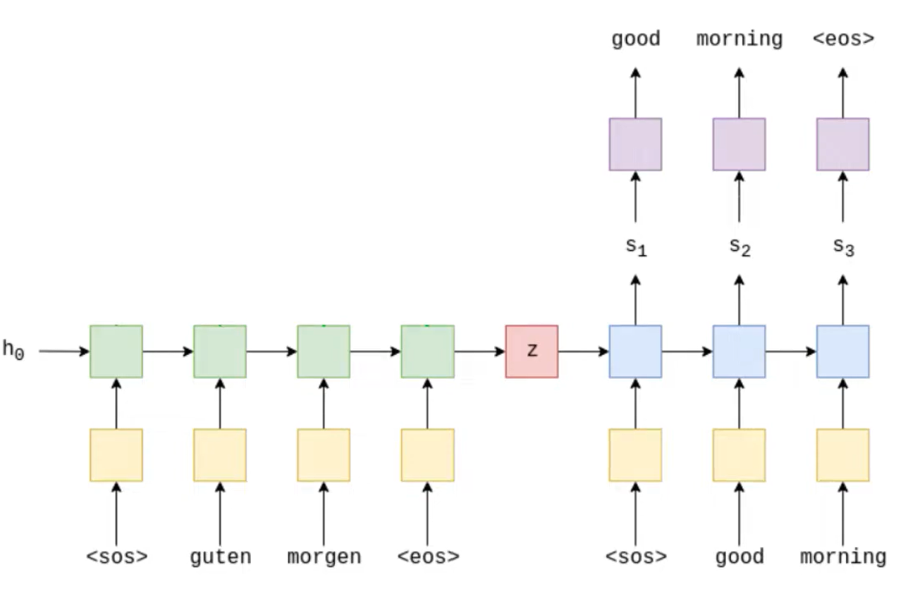

# 🔄 Sequence-to-Sequence Machine Translation (PyTorch)

This project implements a basic **Sequence-to-Sequence (Seq2Seq)** model for **machine translation** using PyTorch. It focuses on converting an input sentence (e.g., in German) into an output sentence (e.g., in English), based on an **encoder-decoder LSTM** architecture with optional **teacher forcing**.

Inspired by [Aladdin Persson's PyTorch tutorial](https://github.com/aladdinpersson/Machine-Learning-Collection/blob/master/ML/Pytorch/more_advanced/Seq2Seq/seq2seq.py).

---

## 📌 What is Seq2Seq?

**Sequence-to-Sequence** is a neural network architecture used for tasks where **input and output are both sequences**, such as:
- Machine translation (e.g., German → English)
- Chatbots
- Text summarization

It consists of two components:

1. **Encoder**: Processes the input sequence and returns the final hidden and cell states.
2. **Decoder**: Takes the encoder's final states and generates the output sequence one token at a time.

---

## 🧠 Key Concepts

### 🔁 1. Encoder-Decoder Architecture

The encoder processes the input sentence and compresses it into a context vector (hidden and cell state). The decoder then generates the translated sentence based on that context.

```python
encoder_outputs, (hidden, cell) = self.encoder(src)     # input sequence → hidden state
outputs, (hidden, cell) = self.decoder(trg, (hidden, cell))  # use context + trg input
```

### 🧪 2. Teacher Forcing
During training, instead of always using the decoder's previous prediction as the next input, we sometimes use the actual ground truth token. This is called teacher forcing and is controlled by a ratio:

```python
input = trg[t] if random.random() < teacher_forcing_ratio else prediction.argmax(1)
```

- High ratio = easier training (uses more ground truth)

- Low ratio = model learns to rely on its own predictions (harder but more realistic)


## 🧱 Code Structure & Highlights
### ✨ Model Setup

```python
class Seq2Seq(nn.Module):
    def __init__(self, encoder, decoder):
        ...
    def forward(self, src, trg, teacher_forcing_ratio=0.5):
        ...
```
- src = input sentence (e.g., German)

- trg = target sentence (e.g., English)

- teacher_forcing_ratio = how often to use ground truth as next input


### 🔑 Important Components
Encoder
```python
class Encoder(nn.Module):
    self.embedding = nn.Embedding(input_dim, embed_size)
    self.rnn = nn.LSTM(embed_size, hidden_size, num_layers)
```
- Converts input sentence to embeddings
- Runs through LSTM to produce final (hidden, cell) states
Decoder
```python
class Decoder(nn.Module):
    self.embedding = nn.Embedding(output_dim, embed_size)
    self.rnn = nn.LSTM(embed_size + hidden_size, hidden_size, num_layers)
    self.fc_out = nn.Linear(hidden_size, output_dim)
```
- Takes the previous word and encoder's context
- Generates one token at a time

### 🔄 Forward Flow (Training)
```python
for t in range(1, trg_len):
    output, (hidden, cell) = self.decoder(input, (hidden, cell))
    prediction = self.fc_out(output)
    input = trg[t] if random.random() < teacher_forcing_ratio else prediction.argmax(1)
```
This loop:
- Steps through the output sentence
- Uses either the ground truth (trg[t]) or the model's last prediction

### 🧪 How to Train
Prepare your tokenized and indexed datasets and use the model like:
```python
model = Seq2Seq(encoder, decoder).to(device)

for epoch in range(num_epochs):
    output = model(src, trg, teacher_forcing_ratio=0.5)
    loss = criterion(output[1:].reshape(-1, output_dim), trg[1:].reshape(-1))
```

### 📐 Tensor Shapes
| Component     | Shape                                    | Description                  |
| ------------- | ---------------------------------------- | ---------------------------- |
| `src`         | (src\_len, batch\_size)                  | Source language input        |
| `trg`         | (trg\_len, batch\_size)                  | Target language ground truth |
| `output`      | (trg\_len, batch\_size, output\_dim)     | Predicted token scores       |
| `hidden/cell` | (num\_layers, batch\_size, hidden\_size) | RNN state                    |

### 🙏 Credits
This project is based on:
Aladdin Persson's Seq2Seq Tutorial (GitHub)

### 👨‍💻 Author
Built with ❤️ using PyTorch.
Feel free to fork, adapt, or contribute to this project!


